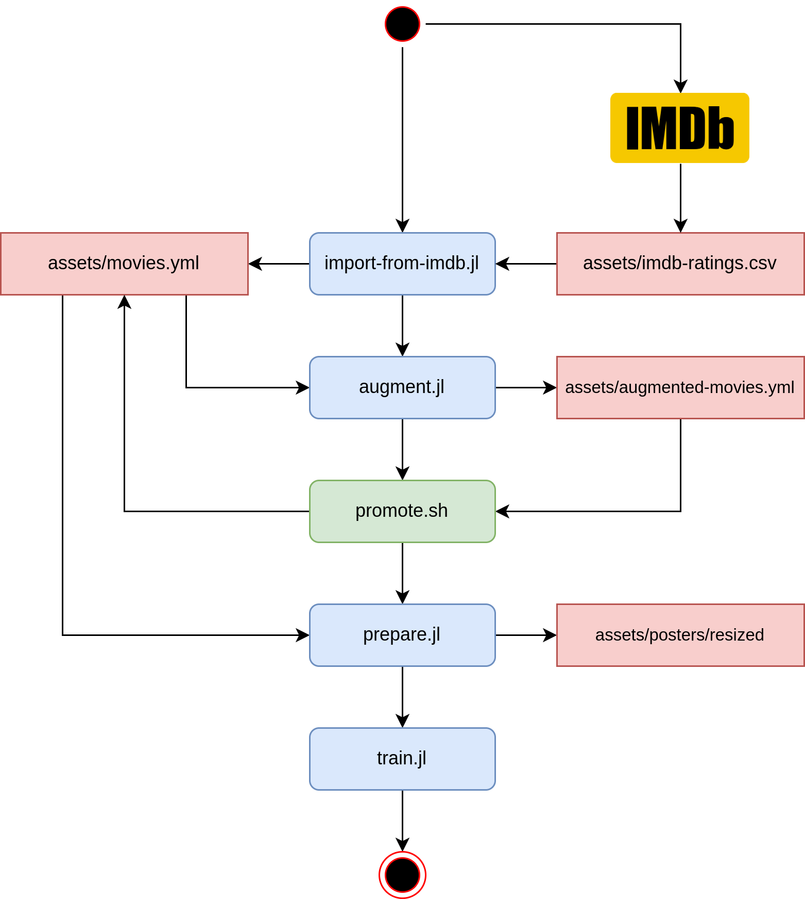

# Posterior

<p align="center">
    
</p>

**Posterior** - movie recommender system based on **poster** analysis.

# Running

<p align="center">
    
</p>

To run the app use the following command, which allows to augment data about movies in `assets/movies.yml` using [omdb](https://www.omdbapi.com/) api:

```sh
julia --project=. posterior/augment.jl
```

It is also possible to specify current project through env variable:

```sh
export JULIA_PROJECT=.

julia posterior/main.jl
```

The command generates file `assets/augmented-movies.yml` which can be renamed to `assets/movies.yml` by executing the following command:

```sh
./promote.sh
```

The older version of `assets/movies.yml` is also preserved as `assets/__movies.yml`

Call all scripts specified in the workflow at the top of the page to prepare data and train the model.

# Installing julia

For installing julia see the appropriate [installation script](install-julia.sh)

# Installing dependencies

To install dependencies activate and instantiate the environment:

```sh
julia --project=. -e 'using Pkg; Pkg.instantiate()'
```
