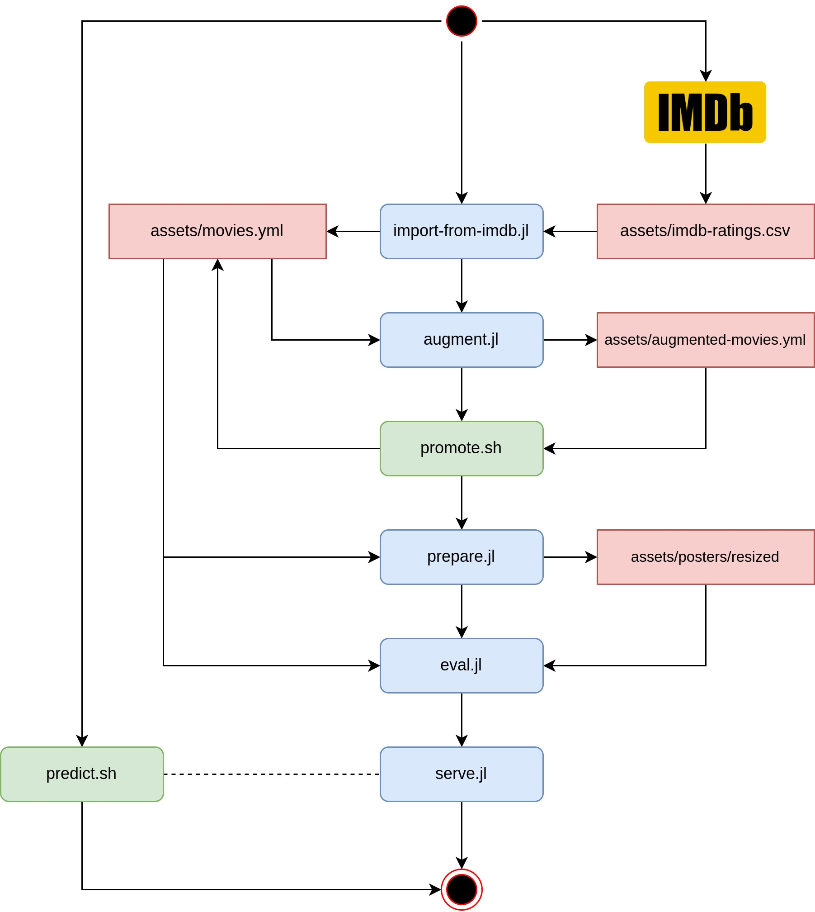

# Posterior

<p align="center">
    
</p>

**Posterior** - movie recommender system based on **poster** analysis.

# Running

<p align="center">
    
</p>

To run the app execute the following sequence of steps:

```sh
git clone https://github.com/zeionara/posterior.git
cd posterior

export OMDB_API_KEY=<your-omdb-api-key-here>

source setup.sh
./run.sh
```

## Details

To fetch posters and basic information about movies use the following command, which allows to augment data about movies in `assets/movies.yml` using [omdb](https://www.omdbapi.com/) api:

```sh
julia --project=. posterior/augment.jl
```

It is also possible to specify current project through env variable:

```sh
export JULIA_PROJECT=.
```

The command generates file `assets/augmented-movies.yml` which can be renamed to `assets/movies.yml` by executing the following command:

```sh
./promote.sh
```

The older version of `assets/movies.yml` is also preserved as `assets/__movies.yml`

Call all scripts specified in the workflow at the top of the page to prepare data and train the model.

The last step is the model evaluation, which can be launched on an existing model (skipping the train step):

```sh
./posterior/eval.jl -t 0.8 -s 17 --input-path 'assets/models/v1-n-epochs=10-seed=17.bson'
```

To generate movie label for poster using url you can use the `predict.sh` script which will call deployed server with trained model:

```sh
./predict.sh https://foo.bar/baz.png
```

The server answers with rating in the interval `[1; 10]`, for example:

```json
{
  "rating":8
}
```

# Installing julia

For installing julia see the appropriate [installation script](install-julia.sh) or the [setup script](setup.sh) which both installs julia and project dependencies.

# Installing dependencies

To install dependencies manually activate and instantiate the environment:

```sh
julia --project=. -e 'using Pkg; Pkg.instantiate()'
```
